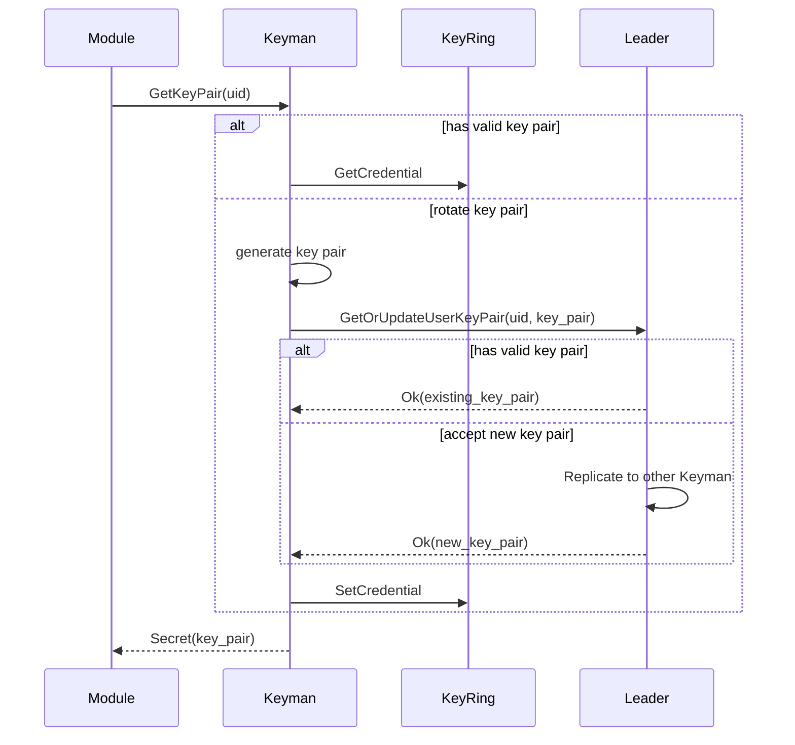

!!! WARNING
    Not implemented

When a module (http or mailman) asks for a user's key pair:

```mermaid
sequenceDiagram
  Module->>Keyman: GetKeyPair(uid)
  alt has valid key pair
    Keyman->>KeyRing: GetCredential
  else rotate key pair
    Keyman->>Keyman: generate key pair
    Keyman->>Leader: GetOrUpdateUserKeyPair(uid, key_pair)
    alt has valid key pair
    Leader-->>Keyman: Ok(existing_key_pair)
    else accept new key pair
    Leader->>Leader: Replicate to other Keyman
    Leader-->>Keyman: Ok(new_key_pair)
    end
    Keyman->>KeyRing: SetCredential
  end
  Keyman-->>Module: Secret(key_pair)
```
