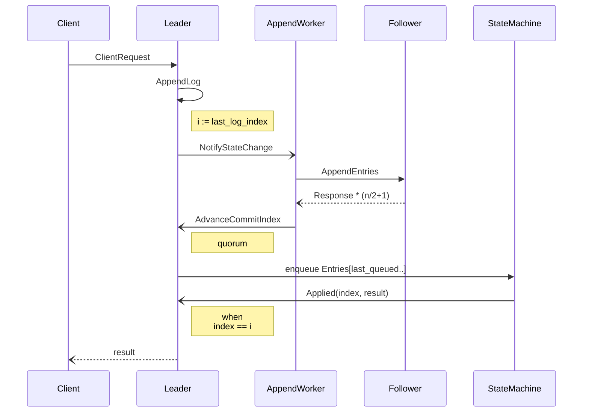
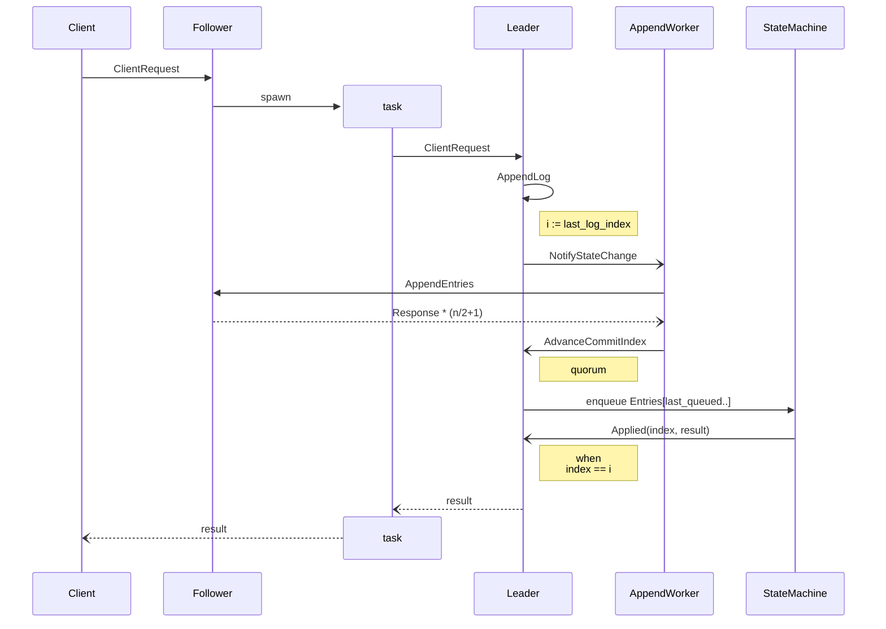

When client contacts the Leader:

```mermaid
sequenceDiagram
  Client->>Leader: ClientRequest
  Leader->>Leader: AppendLog
  note right of Leader: i := last_log_index
  Leader-)AppendWorker: NotifyStateChange
  AppendWorker->>Follower: AppendEntries
  Follower--)AppendWorker: Response * (n/2+1)
  AppendWorker-)Leader: AdvanceCommitIndex
  note right of Leader: quorum
  Leader->>StateMachine: enqueue Entries[last_queued..]
  StateMachine-)Leader: Applied(index, result)
  note right of Leader: when<br/> index == i
  Leader--)Client: result
```

When client contacts a Follower:

```mermaid
sequenceDiagram
  Client->>Follower: ClientRequest
  create participant task
  Follower->>task: spawn
  task->>Leader: ClientRequest
  Leader->>Leader: AppendLog
  note right of Leader: i := last_log_index
  Leader-)AppendWorker: NotifyStateChange
  AppendWorker->>Follower: AppendEntries
  Follower--)AppendWorker: Response * (n/2+1)
  AppendWorker-)Leader: AdvanceCommitIndex
  note right of Leader: quorum
  Leader->>StateMachine: enqueue Entries[last_queued..]
  StateMachine-)Leader: Applied(index, result)
  note right of Leader: when<br/> index == i
  Leader--)task: result
  destroy task
  task--)Client: result
```
